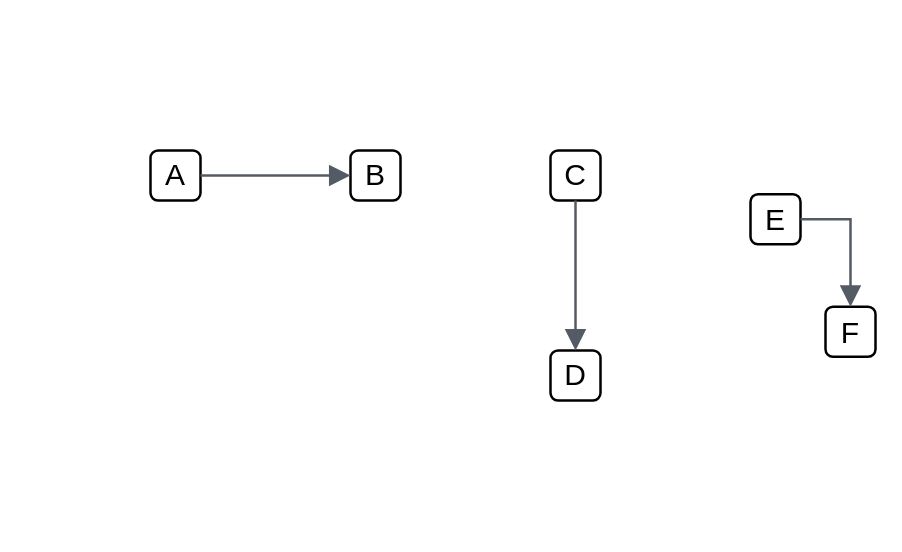

# Default (left) 2

## Definition

```js
{
  _style: {
    dependency: 'edgeStyle=orthogonalEdgeStyle;html=1;endArrow=block;elbow=vertical;startArrow=none;endFill=1;strokeColor=#545B64;rounded=0;',
  },
}
```

## Usage

```js
import { DefaultLeft2 } from '@dinghy/standard-components-diagrams/aws18Arrows'

<DefaultLeft2/>
```

## Preview


