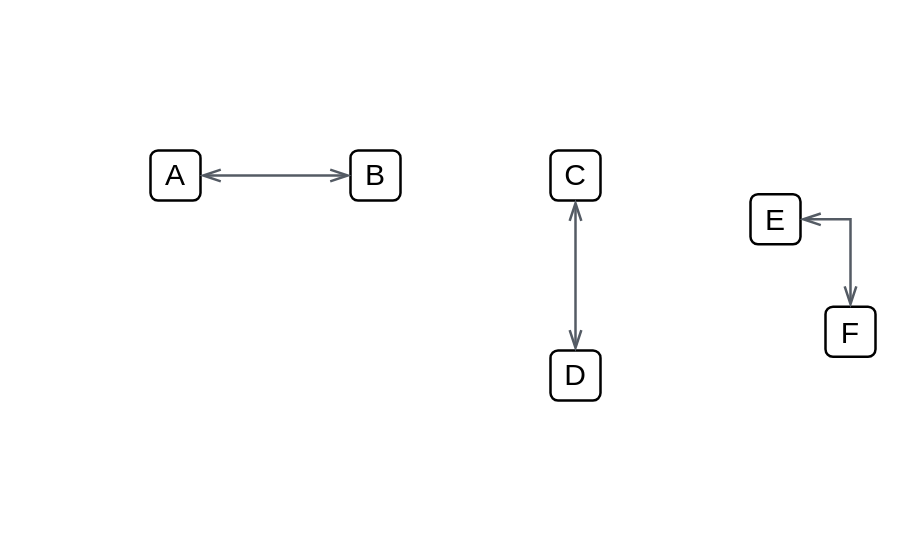

# Open (thin, double)

## Definition

```js
{
  _style: {
    dependency: 'edgeStyle=orthogonalEdgeStyle;html=1;endArrow=openThin;elbow=vertical;startArrow=openThin;startFill=0;endFill=0;strokeColor=#545B64;rounded=0;',
  },
}
```

## Usage

```js
import { OpenThinDouble } from '@dinghy/standard-components-diagrams/aws18Arrows'

<OpenThinDouble/>
```

## Preview


