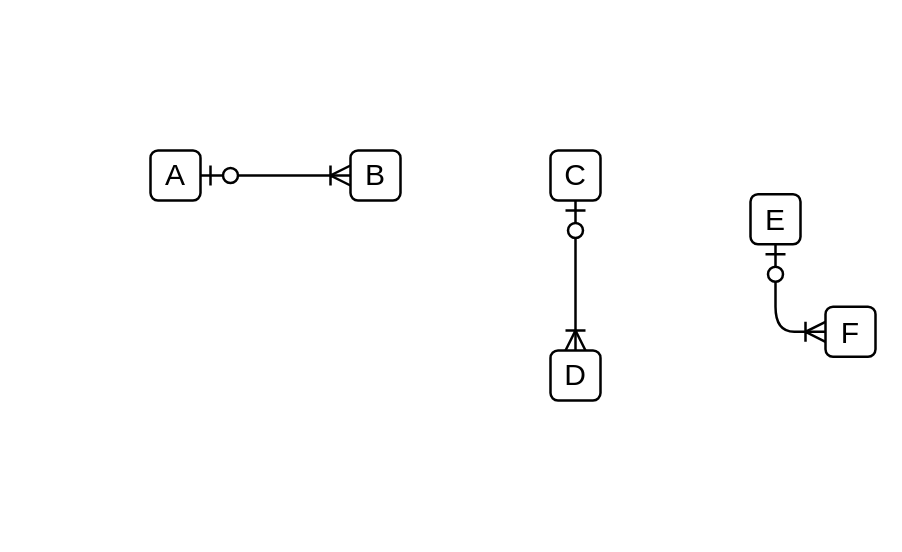

# 1 Optional to Many Mandatory

## Definition

```js
{
  _style: {
    dependency: 'edgeStyle=entityRelationEdgeStyle;fontSize=12;html=1;endArrow=ERoneToMany;startArrow=ERzeroToOne;',
  },
}
```

## Usage

```js
import { Component1OptionalToManyMandatory } from '@dinghy/standard-components-diagrams/entityRelation'

<Component1OptionalToManyMandatory/>
```

## Preview


