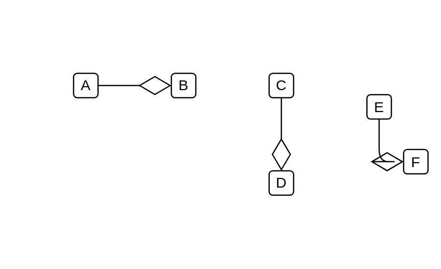

# Aggregation 2

## Definition

```js
{
  _style: {
    dependency: 'endArrow=diamondThin;endFill=0;endSize=24;html=1;',
  },
}
```

## Usage

```js
import { Aggregation2 } from '@dinghy/standard-components-diagrams/uml'

<Aggregation2/>
```

## Preview


