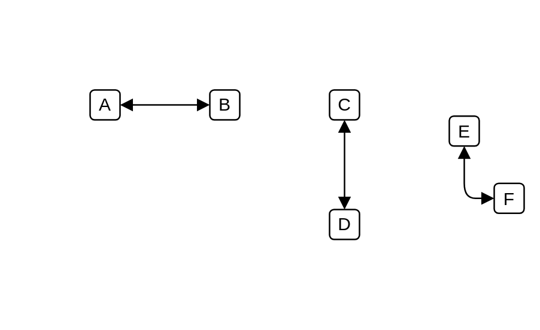

# Association 2

## Definition

```js
{
  _style: {
    dependency: 'endArrow=block;startArrow=block;endFill=1;startFill=1;html=1;',
  },
}
```

## Usage

```js
import { Association2 } from '@dinghy/standard-components-diagrams/uml'

<Association2/>
```

## Preview


