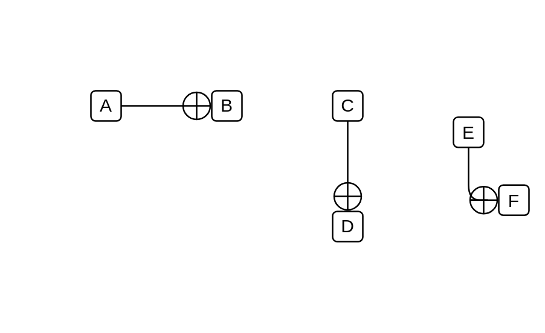

# Inner class

## Definition

```js
{
  _style: {
    dependency: 'endArrow=circlePlus;startArrow=none;endFill=0;startFill=0;endSize=8;html=1;labelBackgroundColor=none;',
  },
}
```

## Usage

```js
import { InnerClass } from '@dinghy/standard-components-diagrams/uml25'

<InnerClass/>
```

## Preview


