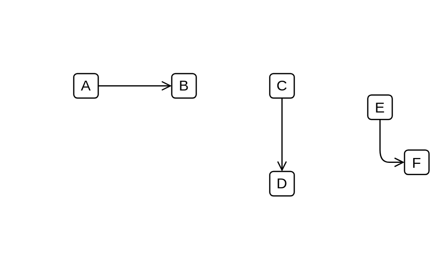

# Message

## Definition

```js
{
  _style: {
    dependency: 'html=1;verticalAlign=bottom;labelBackgroundColor=none;endArrow=open;endFill=0;',
  },
}
```

## Usage

```js
import { Message } from '@dinghy/standard-components-diagrams/uml25'

<Message/>
```

## Preview


