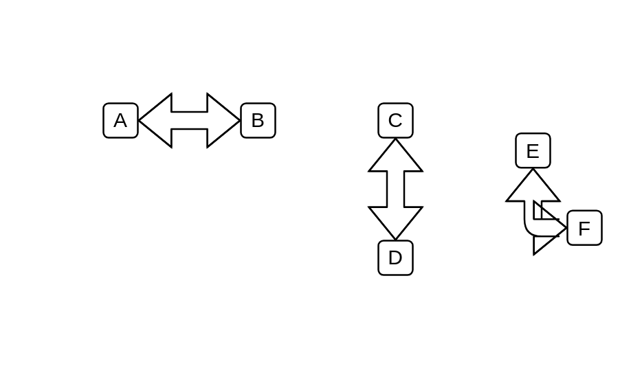
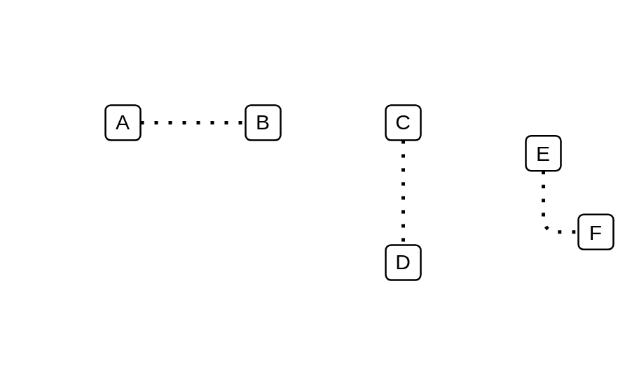
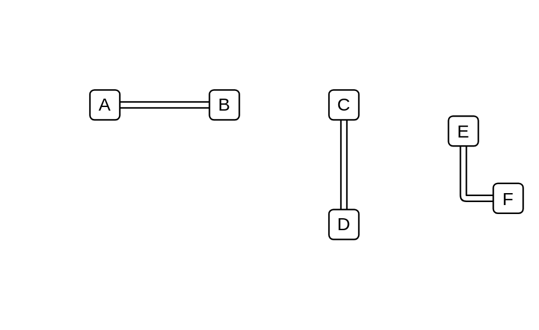

# Standard General Dependencies

- [Arrow](./arrow.md)  

- [BidirectionalArrow](./bidirectional-arrow.md)  

- [BidirectionalConnector](./bidirectional-connector.md)  

- [DashedLine](./dashed-line.md)  

- [DirectionalConnector](./directional-connector.md)  

- [DottedLine](./dotted-line.md)  

- [Line](./line.md)  

- [Link](./link.md)  

