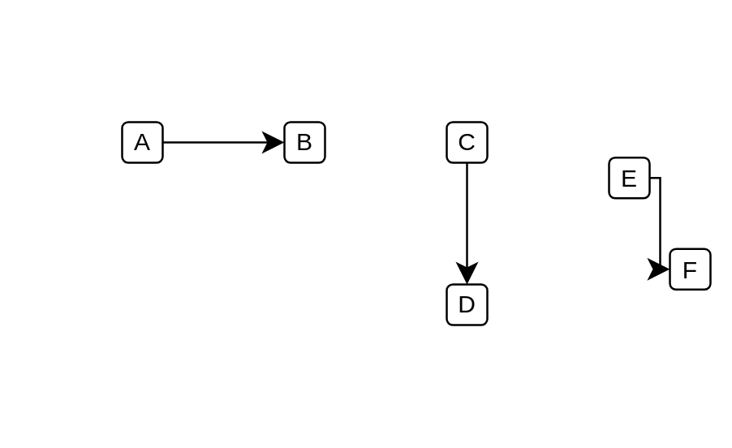

# Horizontal Elbow

## Definition

```js
{
  _style: {
    dependency: 'edgeStyle=elbowEdgeStyle;elbow=horizontal;endArrow=classic;html=1;curved=0;rounded=0;endSize=8;startSize=8;',
  },
}
```

## Usage

```js
import { HorizontalElbow } from '@dinghy/standard-components-diagrams/misc'

<HorizontalElbow/>
```

## Preview


