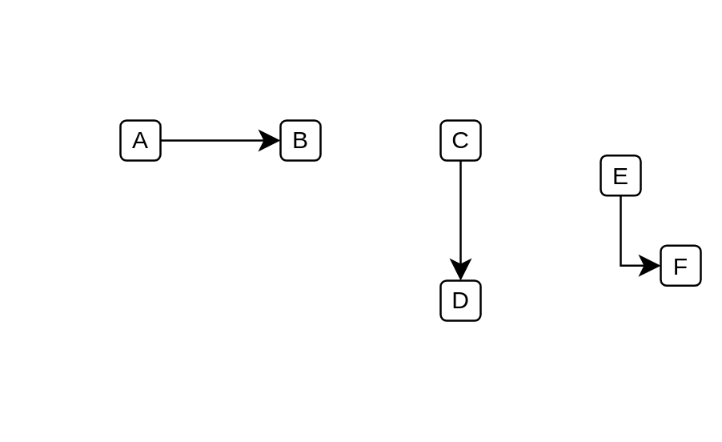

# Manual Line

## Definition

```js
{
  _style: {
    dependency: 'edgeStyle=segmentEdgeStyle;endArrow=classic;html=1;curved=0;rounded=0;endSize=8;startSize=8;',
  },
}
```

## Usage

```js
import { ManualLine } from '@dinghy/standard-components-diagrams/misc'

<ManualLine/>
```

## Preview


