# Archimate3 Generic Entities

- [Collaboration](./collaboration.md)  

- [Collaboration2](./collaboration-2.md)  

- [Event](./event.md)  
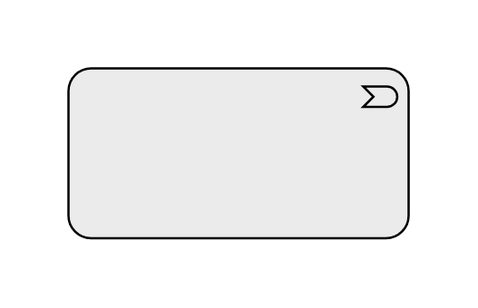

- [Event2](./event-2.md)  
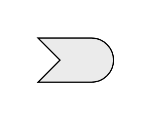

- [Function](./function.md)  

- [Function2](./function-2.md)  
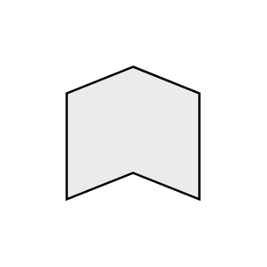

- [Grouping](./grouping.md)  

- [Grouping2](./grouping-2.md)  
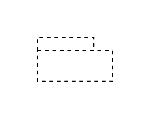

- [Interaction](./interaction.md)  

- [Interaction2](./interaction-2.md)  
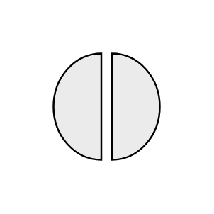

- [Interface](./interface.md)  
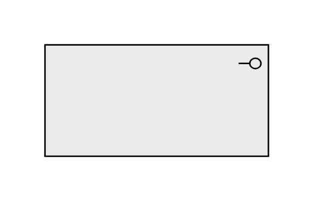

- [Interface2](./interface-2.md)  

- [InternalActiveStructureElement](./internal-active-structure-element.md)  
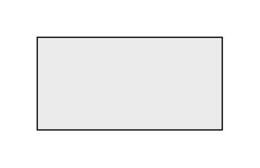

- [InternalBehaviorElement](./internal-behavior-element.md)  
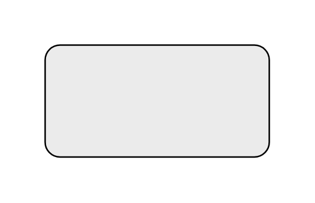

- [Location](./location.md)  

- [Location2](./location-2.md)  

- [MotivationElement](./motivation-element.md)  
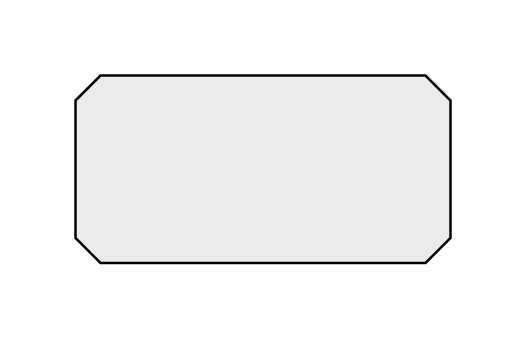

- [PassiveStructureElement](./passive-structure-element.md)  

- [PassiveStructureElement2](./passive-structure-element-2.md)  
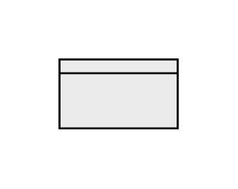

- [Process](./process.md)  

- [Process2](./process-2.md)  

- [Service](./service.md)  

- [Service2](./service-2.md)  
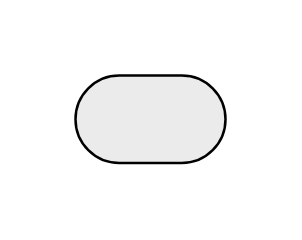
