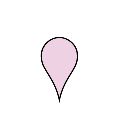

# Location 2

## Definition

```js
{
  _style: {
    entity: 'html=1;outlineConnect=0;whiteSpace=wrap;shape=mxgraph.archimate3.locationIcon;fillColor=#efd1e4;aspect=fixed;',
  },
  _width: 35,
  _height: 50,
}
```

## Usage

```js
import { Location2 } from '@dinghy/standard-components-diagrams/archimate3Generic'

<Location2/>
```

## Preview


