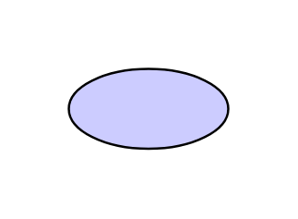

# Value 2

## Definition

```js
{
  _style: {
    entity: 'shape=ellipse;html=1;whiteSpace=wrap;fillColor=#CCCCFF;',
  },
  _width: 70,
  _height: 35,
}
```

## Usage

```js
import { Value2 } from '@dinghy/standard-components-diagrams/archimate3Motivation'

<Value2/>
```

## Preview


