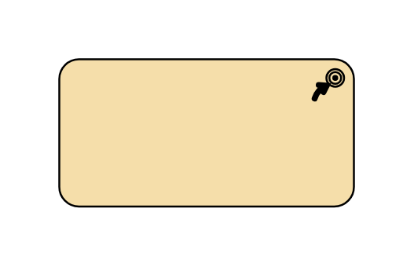

# Course of Action

## Definition

```js
{
  _style: {
    entity: 'html=1;outlineConnect=0;whiteSpace=wrap;fillColor=#F5DEAA;shape=mxgraph.archimate3.application;appType=course;archiType=rounded;',
  },
  _width: 150,
  _height: 75,
}
```

## Usage

```js
import { CourseOfAction } from '@dinghy/standard-components-diagrams/archimate3Strategy'

<CourseOfAction/>
```

## Preview


