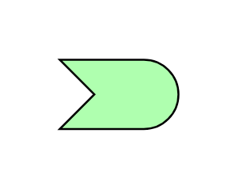

# Event

## Definition

```js
{
  _style: {
    entity: 'html=1;outlineConnect=0;whiteSpace=wrap;fillColor=#AFFFAF;shape=mxgraph.archimate3.event;',
  },
  _width: 60,
  _height: 35,
}
```

## Usage

```js
import { Event } from '@dinghy/standard-components-diagrams/archimate3Technology'

<Event/>
```

## Preview


