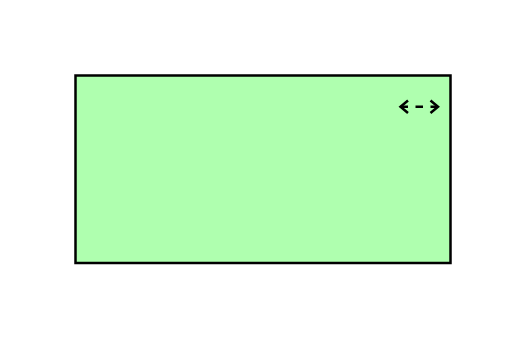

# Path

## Definition

```js
{
  _style: {
    entity: 'html=1;outlineConnect=0;whiteSpace=wrap;fillColor=#AFFFAF;shape=mxgraph.archimate3.application;appType=path;archiType=square;',
  },
  _width: 150,
  _height: 75,
}
```

## Usage

```js
import { Path } from '@dinghy/standard-components-diagrams/archimate3Technology'

<Path/>
```

## Preview


