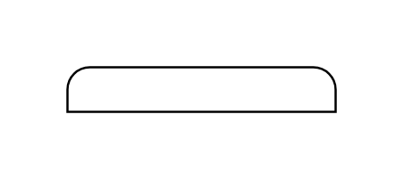

# Participant, Initiating, Top

## Definition

```js
{
  _style: {
    entity: 'whiteSpace=wrap;shape=mxgraph.bpmn.task2;part=1;taskMarker=abstract;rectStyle=rounded;bottomRightStyle=square;bottomLeftStyle=square;html=1;',
  },
  _width: 120,
  _height: 20,
}
```

## Usage

```js
import { ParticipantInitiatingTop } from '@dinghy/standard-components-diagrams/bpmn2Choreographies'

<ParticipantInitiatingTop/>
```

## Preview


