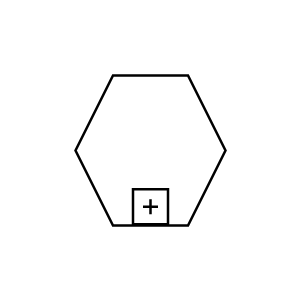

# Sub-Conversation

## Definition

```js
{
  _style: {
    entity: 'shape=mxgraph.bpmn.conversation2;perimeter=hexagonPerimeter2;whiteSpace=wrap;html=1;aspect=fixed;bpmnConversationType=conv;isLoopSub=1;',
  },
  _original_width: 70,
  _original_height: 60,

}
```

## Usage

```js
import { SubConversation } from '@dinghy/standard-components-diagrams/bpmn2General'

<SubConversation/>
```

## Preview


