# Sysml Activities Entities

- [AcceptEventAction](./accept-event-action.md)  
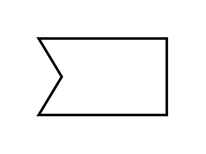

- [Action](./action.md)  

- [ActivityFinal](./activity-final.md)  
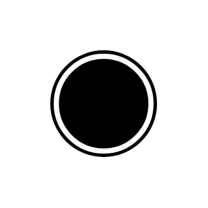

- [ActivityParameterNode](./activity-parameter-node.md)  

- [ActivityPartition](./activity-partition.md)  
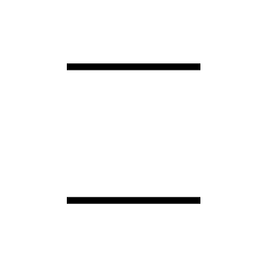

- [ActivityPartition2](./activity-partition-2.md)  
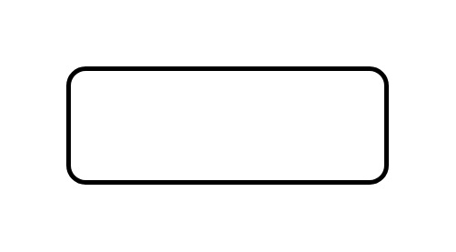

- [CallBehaviorAction](./call-behavior-action.md)  

- [ControlFlow](./control-flow.md)  

- [ControlFlow2](./control-flow-2.md)  
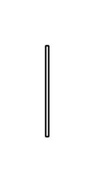

- [ControlFlow3](./control-flow-3.md)  

- [ControlOperator](./control-operator.md)  

- [ControlOperator2](./control-operator-2.md)  

- [DecisionNode](./decision-node.md)  
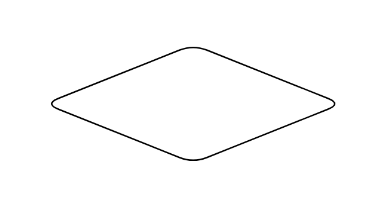

- [DecisionNode2](./decision-node-2.md)  

- [DecisionNode3](./decision-node-3.md)  

- [FlowFinal](./flow-final.md)  
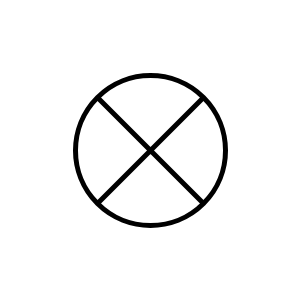

- [ForkNode](./fork-node.md)  

- [ForkNode2](./fork-node-2.md)  

- [ForkNode3](./fork-node-3.md)  

- [InBlockDefinitionDiagramsActivityAssociation](./in-block-definition-diagrams-activity-association.md)  

- [InitialNode](./initial-node.md)  
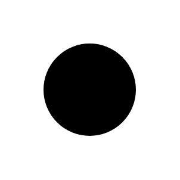

- [InterruptibleActivityRegion](./interruptible-activity-region.md)  

- [InterruptibleActivityRegion2](./interruptible-activity-region-2.md)  

- [IsControl](./is-control.md)  

- [IsControl2](./is-control-2.md)  

- [IsControl3](./is-control-3.md)  

- [IsStream](./is-stream.md)  

- [IsStream2](./is-stream-2.md)  

- [IsStream3](./is-stream-3.md)  

- [IsStream4](./is-stream-4.md)  

- [JoinNode](./join-node.md)  

- [JoinNode2](./join-node-2.md)  

- [JoinNode3](./join-node-3.md)  
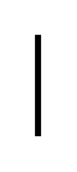

- [LocalPreAndPostconditions](./local-pre-and-postconditions.md)  
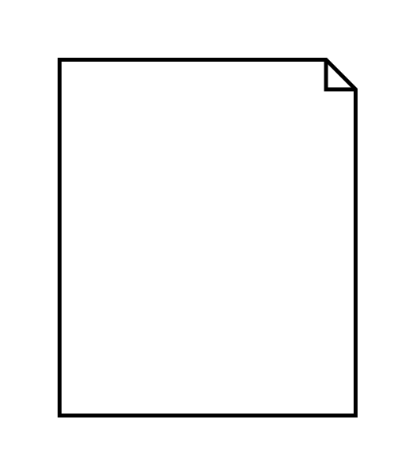

- [LocalPreAndPostconditions2](./local-pre-and-postconditions-2.md)  

- [LocalPreAndPostconditions3](./local-pre-and-postconditions-3.md)  

- [MergeNode](./merge-node.md)  
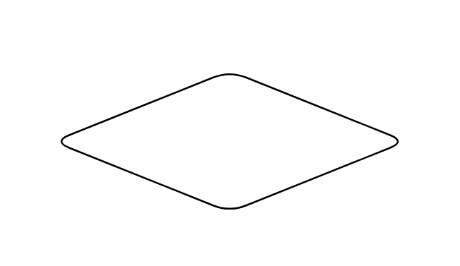

- [MergeNode2](./merge-node-2.md)  

- [MergeNode3](./merge-node-3.md)  
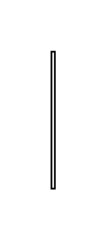

- [ObjectFlow](./object-flow.md)  

- [ObjectFlow2](./object-flow-2.md)  

- [ObjectFlow3](./object-flow-3.md)  

- [ObjectFlow4](./object-flow-4.md)  

- [ObjectFlow5](./object-flow-5.md)  

- [ObjectFlow6](./object-flow-6.md)  
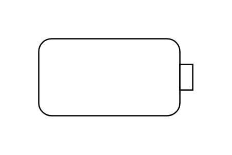

- [ObjectFlow7](./object-flow-7.md)  

- [ObjectNode](./object-node.md)  

- [Optional](./optional.md)  

- [ParameterSet](./parameter-set.md)  
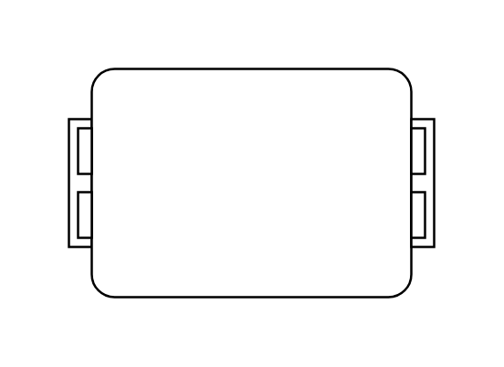

- [ParameterSet2](./parameter-set-2.md)  

- [Probability](./probability.md)  

- [Probability2](./probability-2.md)  

- [Probability3](./probability-3.md)  
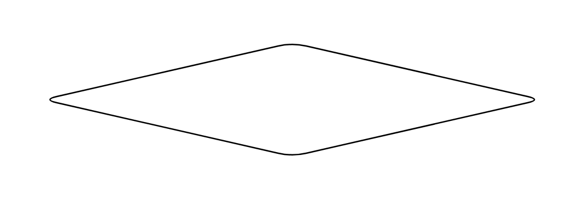

- [Probability4](./probability-4.md)  
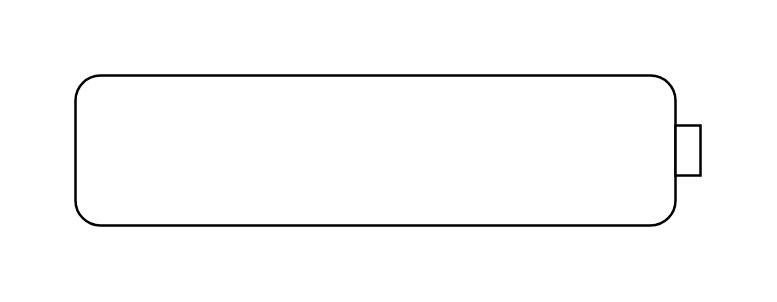

- [Probability5](./probability-5.md)  

- [Probability6](./probability-6.md)  

- [Probability7](./probability-7.md)  
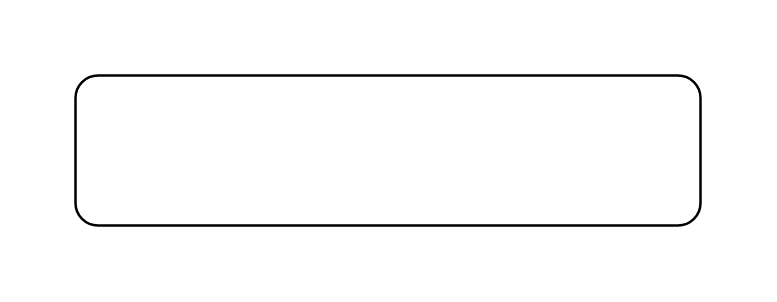

- [Probability8](./probability-8.md)  

- [Probability9](./probability-9.md)  

- [Rate](./rate.md)  

- [Rate2](./rate-2.md)  

- [Rate3](./rate-3.md)  
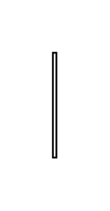

- [SendSignalAction](./send-signal-action.md)  
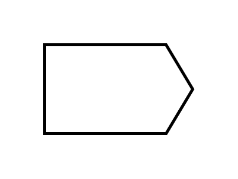

- [StructuredActivityNode](./structured-activity-node.md)  
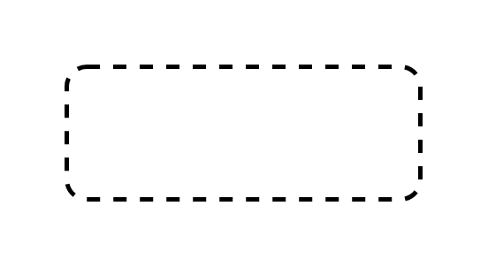

- [TimeEvent](./time-event.md)  
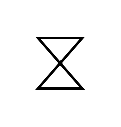
