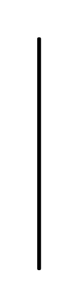

# Local Pre- and Postconditions 2

## Definition

```js
{
  _style: {
    entity: 'shape=rect;html=1;rounded=1;strokeWidth=2;whiteSpace=wrap;align=center;',
  },
  _width: 1,
  _height: 180,
}
```

## Usage

```js
import { LocalPreAndPostconditions2 } from '@dinghy/standard-components-diagrams/sysmlActivities'

<LocalPreAndPostconditions2/>
```

## Preview


