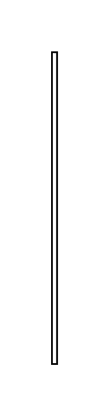

# Local Pre- and Postconditions 3

## Definition

```js
{
  _style: {
    entity: 'edgeStyle=elbowEdgeStyle;html=1;elbow=horizontal;rounded=0;endArrow=none;',
  },
  _width: 3,
  _height: 180,
}
```

## Usage

```js
import { LocalPreAndPostconditions3 } from '@dinghy/standard-components-diagrams/sysmlActivities'

<LocalPreAndPostconditions3/>
```

## Preview


