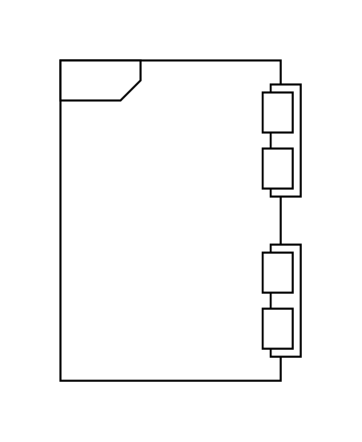

# Probability 2

## Definition

```js
{
  _style: {
    entity: 'html=1;shape=mxgraph.sysml.actProb;align=left;spacingLeft=5;verticalAlign=top;spacingTop=-3;fontStyle=1;',
  },
  _width: 120,
  _height: 160,
}
```

## Usage

```js
import { Probability2 } from '@dinghy/standard-components-diagrams/sysmlActivities'

<Probability2/>
```

## Preview


