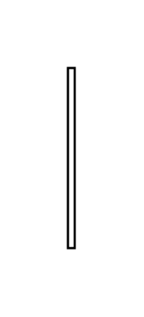

# Participant Property 5

## Definition

```js
{
  _style: {
    entity: 'edgeStyle=none;endArrow=none;html=1;rounded=0;',
  },
  _width: 3,
  _height: 80,
}
```

## Usage

```js
import { ParticipantProperty5 } from '@dinghy/standard-components-diagrams/sysmlBlocks'

<ParticipantProperty5/>
```

## Preview


