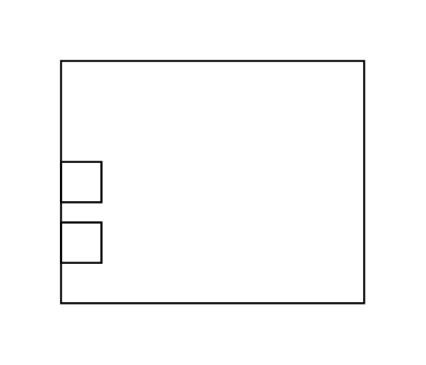

# Constraint Property 2

## Definition

```js
{
  _style: {
    entity: 'html=1;shape=mxgraph.sysml.consProp;overflow=fill;whiteSpace=wrap;',
  },
  _width: 150,
  _height: 120,
}
```

## Usage

```js
import { ConstraintProperty2 } from '@dinghy/standard-components-diagrams/sysmlConstraintBlocks'

<ConstraintProperty2/>
```

## Preview


