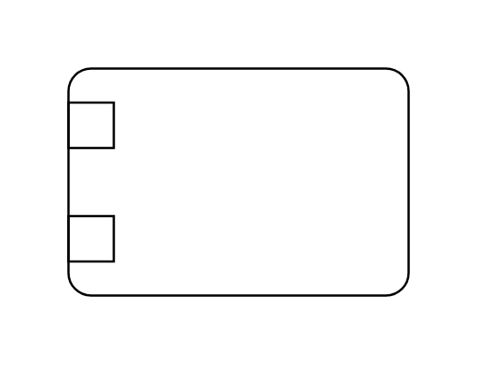

# Constraint Property

## Definition

```js
{
  _style: {
    entity: 'html=1;shape=mxgraph.sysml.paramDgm;fontStyle=1;whiteSpace=wrap;align=center;',
  },
  _width: 150,
  _height: 100,
}
```

## Usage

```js
import { ConstraintProperty } from '@dinghy/standard-components-diagrams/sysmlConstraintBlocks'

<ConstraintProperty/>
```

## Preview


