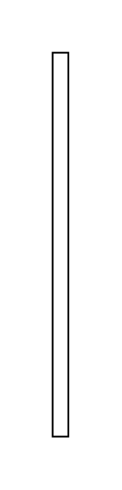

# Creation/Destruction Event 5

## Definition

```js
{
  _style: {
    entity: 'edgeStyle=elbowEdgeStyle;endArrow=open;elbow=vertical;endSize=12;html=1;rounded=0;',
  },
  _width: 9,
  _height: 220,
}
```

## Usage

```js
import { CreationDestructionEvent5 } from '@dinghy/standard-components-diagrams/sysmlInteractions'

<CreationDestructionEvent5/>
```

## Preview


