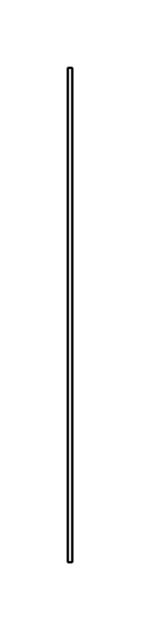

# Creation/Destruction Event

## Definition

```js
{
  _style: {
    entity: 'shape=rect;fillColor=#eeeeee;html=1;',
  },
  _width: 2,
  _height: 220,
}
```

## Usage

```js
import { CreationDestructionEvent } from '@dinghy/standard-components-diagrams/sysmlInteractions'

<CreationDestructionEvent/>
```

## Preview


