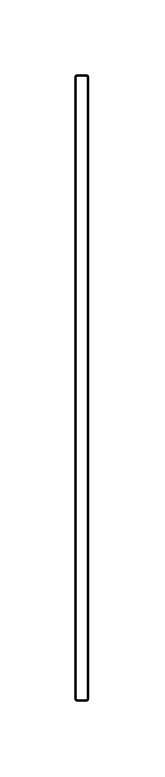

# Duration Constraint 5

## Definition

```js
{
  _style: {
    entity: 'edgeStyle=none;html=1;endArrow=open;verticalAlign=top;spacingTop=5;endSize=12;',
  },
  _width: 5,
  _height: 250,
}
```

## Usage

```js
import { DurationConstraint5 } from '@dinghy/standard-components-diagrams/sysmlInteractions'

<DurationConstraint5/>
```

## Preview


