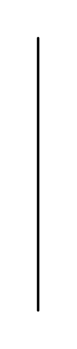

# State Invariant / Continuations

## Definition

```js
{
  _style: {
    entity: 'html=1;shape=mxgraph.sysml.cont;fontStyle=1;whiteSpace=wrap;align=center;',
  },
  _width: 1,
  _height: 220,
}
```

## Usage

```js
import { StateInvariantContinuations } from '@dinghy/standard-components-diagrams/sysmlInteractions'

<StateInvariantContinuations/>
```

## Preview


