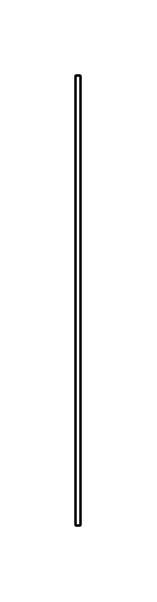

# Item Flow 3

## Definition

```js
{
  _style: {
    entity: 'edgeStyle=none;html=1;align=right;endArrow=none;exitX=0.5;exitY=1;entryX=0.5;entryY=0;',
  },
  _width: 2,
  _height: 180,
}
```

## Usage

```js
import { ItemFlow3 } from '@dinghy/standard-components-diagrams/sysmlPortsAndFlows'

<ItemFlow3/>
```

## Preview


