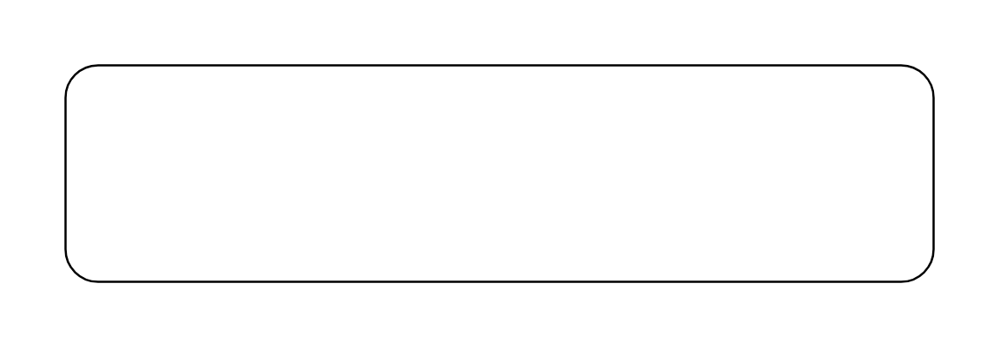
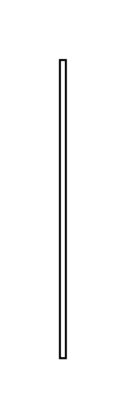

# Sysml Stereotypes Entities

- [StereotypeCompartment](./stereotype-compartment.md)  

- [StereotypeCompartment2](./stereotype-compartment-2.md)  

- [StereotypeEdge](./stereotype-edge.md)  

- [StereotypeNode](./stereotype-node.md)  

- [StereotypeNote](./stereotype-note.md)  

- [StereotypeNote2](./stereotype-note-2.md)  

- [StereotypeNote3](./stereotype-note-3.md)  

- [StereotypeNote4](./stereotype-note-4.md)  

