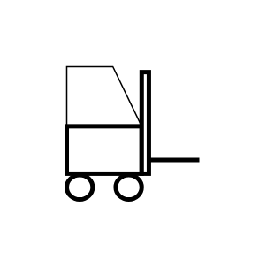

# Move by Forklift

## Definition

```js
{
  _style: {
    entity: 'verticalLabelPosition=bottom;html=1;verticalAlign=top;strokeWidth=2;shape=mxgraph.lean_mapping.move_by_forklift;',
  },
  _original_width: 92,
  _original_height: 100,

}
```

## Usage

```js
import { MoveByForklift } from '@dinghy/standard-components-diagrams/valueStreamMapping'

<MoveByForklift/>
```

## Preview


