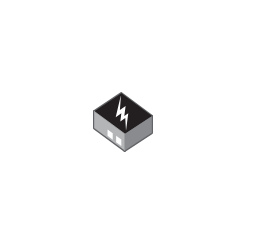

# Media Converter Standalone POE

## Definition

```js
{
  _style: {
    entity: 'image;points=[];aspect=fixed;html=1;align=center;shadow=0;dashed=0;image=img/lib/allied_telesis/media_converters/Media_Converter_Standalone_POE.svg;strokeColor=none;',
  },
  _width: 45.6,
  _height: 37.2,
}
```

## Usage

```js
import { MediaConverterStandalonePoe } from '@dinghy/standard-components-diagrams/alliedTelesisMediaConverters'

<MediaConverterStandalonePoe/>
```

## Preview


