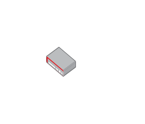

# Router VPN

## Definition

```js
{
  _style: {
    entity: 'image;points=[];aspect=fixed;html=1;align=center;shadow=0;dashed=0;image=img/lib/allied_telesis/security/Router_VPN.svg;strokeColor=none;',
  },
  _width: 55.800000000000004,
  _height: 39.6,
}
```

## Usage

```js
import { RouterVpn } from '@dinghy/standard-components-diagrams/alliedTelesisSecurity'

<RouterVpn/>
```

## Preview


