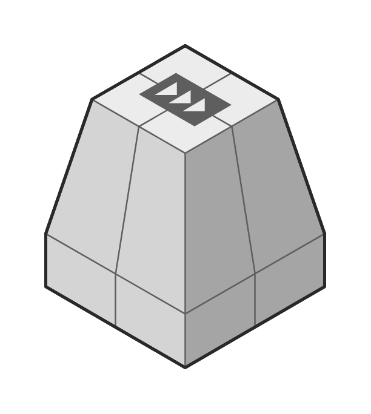

# SQS

## Definition

```js
{
  _style: {
    entity: 'verticalLabelPosition=bottom;html=1;verticalAlign=top;strokeWidth=1;align=center;outlineConnect=0;dashed=0;outlineConnect=0;shape=mxgraph.aws3d.sqs;fillColor=#ECECEC;strokeColor=#5E5E5E;aspect=fixed;',
  },
  _width: 184,
  _height: 212.75,
}
```

## Usage

```js
import { Sqs } from '@dinghy/standard-components-diagrams/aws3d'

<Sqs/>
```

## Preview


