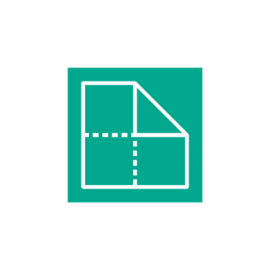
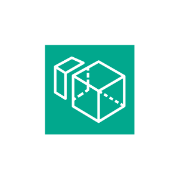
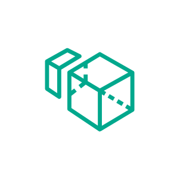
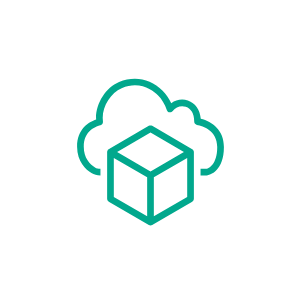
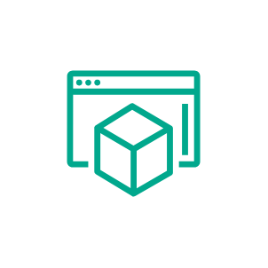

# Aws End User Computing Entities

- [Appstream20](./appstream-2-0.md)  

- [EndUserComputing](./end-user-computing.md)  

- [Workdocs](./workdocs.md)  

- [Worklink](./worklink.md)  

- [Workspaces](./workspaces.md)  

- [WorkspacesFamily](./workspaces-family.md)  

- [WorkspacesFamilyAmazonWorkspaces](./workspaces-family-amazon-workspaces.md)  

- [WorkspacesFamilyAmazonWorkspacesCore](./workspaces-family-amazon-workspaces-core.md)  

- [WorkspacesSecureBrowser](./workspaces-secure-browser.md)  

- [WorkspacesThinClient](./workspaces-thin-client.md)  

