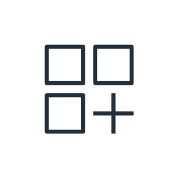
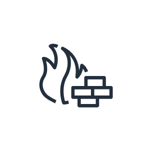
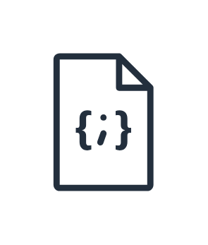
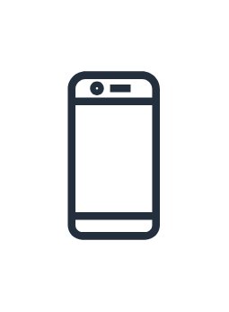
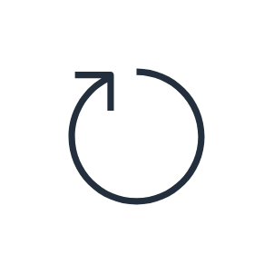
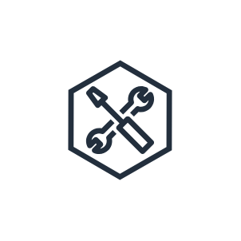

# Aws General Resources Entities

- [Alert](./alert.md)  

- [AllProducts](./all-products.md)  

- [AllProducts2](./all-products-2.md)  

- [AuthenticatedUser](./authenticated-user.md)  

- [Camera](./camera.md)  

- [Chat](./chat.md)  

- [Client](./client.md)  

- [ColdStorage](./cold-storage.md)  

- [CorporateDataCenter](./corporate-data-center.md)  

- [Credentials](./credentials.md)  

- [DataStream](./data-stream.md)  

- [DataTable](./data-table.md)  

- [Disk](./disk.md)  

- [Document](./document.md)  

- [Documents](./documents.md)  

- [Documents2](./documents-2.md)  

- [Documents3](./documents-3.md)  

- [Email](./email.md)  

- [Folder](./folder.md)  

- [Folders](./folders.md)  

- [Forums](./forums.md)  

- [Gear](./gear.md)  

- [General](./general.md)  

- [GenericApplication](./generic-application.md)  

- [GenericDatabase](./generic-database.md)  

- [GenericFirewall](./generic-firewall.md)  

- [GitRepository](./git-repository.md)  

- [Globe](./globe.md)  

- [Internet](./internet.md)  

- [Internet2](./internet-2.md)  

- [Internet3](./internet-3.md)  

- [Internet4](./internet-4.md)  

- [JsonScript](./json-script.md)  

- [Logs](./logs.md)  

- [MagnifyingGlass](./magnifying-glass.md)  

- [ManagementConsole](./management-console.md)  

- [Marketplace](./marketplace.md)  

- [Marketplace2](./marketplace-2.md)  

- [Metrics](./metrics.md)  

- [MobileClient](./mobile-client.md)  

- [Multimedia](./multimedia.md)  

- [OfficeBuilding](./office-building.md)  

- [ProgrammingLanguage](./programming-language.md)  

- [Question](./question.md)  

- [Recover](./recover.md)  

- [SamlToken](./saml-token.md)  

- [Sdk](./sdk.md)  

- [Servers](./servers.md)  

- [Shield](./shield.md)  

- [SourceCode](./source-code.md)  

- [SslPadlock](./ssl-padlock.md)  

- [TapeStorage](./tape-storage.md)  

- [Toolkit](./toolkit.md)  

- [TraditionalServer](./traditional-server.md)  

- [User](./user.md)  

- [Users](./users.md)  

