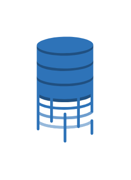
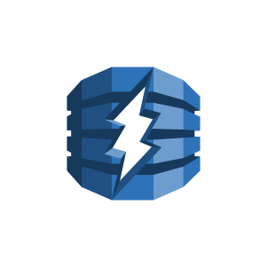
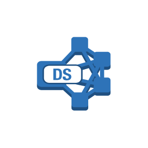
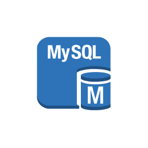
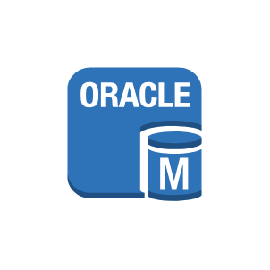
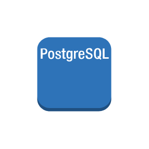
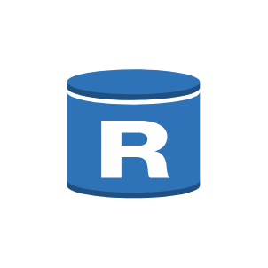

# Aws17 Database Entities

- [Attribute](./attribute.md)  

- [Attributes](./attributes.md)  

- [CacheNode](./cache-node.md)  

- [DatabaseMigrationService](./database-migration-service.md)  

- [DatabaseMigrationWorkflowJob](./database-migration-workflow-job.md)  

- [DbAccelerator](./db-accelerator.md)  

- [DenseComputeNode](./dense-compute-node.md)  

- [DenseStorageNode](./dense-storage-node.md)  

- [DynamoDb](./dynamo-db.md)  

- [Elasticache](./elasticache.md)  

- [GlobalSecondaryIndex](./global-secondary-index.md)  

- [Item](./item.md)  

- [Items](./items.md)  

- [Memcached](./memcached.md)  

- [MsSqlInstance](./ms-sql-instance.md)  

- [MsSqlInstance2](./ms-sql-instance-2.md)  

- [MysqlDbInstance](./mysql-db-instance.md)  

- [MysqlDbInstance2](./mysql-db-instance-2.md)  

- [OracleDbInstance](./oracle-db-instance.md)  

- [OracleDbInstance2](./oracle-db-instance-2.md)  

- [Piop](./piop.md)  

- [PostgreSqlInstance](./postgre-sql-instance.md)  

- [Rds](./rds.md)  

- [RdsDbInstance](./rds-db-instance.md)  

- [RdsDbInstanceReadReplica](./rds-db-instance-read-replica.md)  

- [RdsDbInstanceStandbyMultiAz](./rds-db-instance-standby-multi-az.md)  

- [Redis](./redis.md)  

- [Redshift](./redshift.md)  

- [SqlMaster](./sql-master.md)  

- [SqlSlave](./sql-slave.md)  

- [Table](./table.md)  

