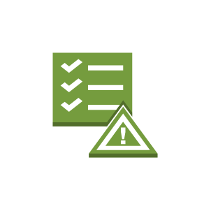

# Checklist Fault Tolerance

## Definition

```js
{
  _style: {
    entity: 'outlineConnect=0;dashed=0;verticalLabelPosition=bottom;verticalAlign=top;align=center;html=1;shape=mxgraph.aws3.checklist_fault_tolerance;fillColor=#759C3E;gradientColor=none;',
  },
  _original_width: 57,
  _original_height: 72,

}
```

## Usage

```js
import { ChecklistFaultTolerance } from '@dinghy/standard-components-diagrams/aws17ManagementTools'

<ChecklistFaultTolerance/>
```

## Preview


