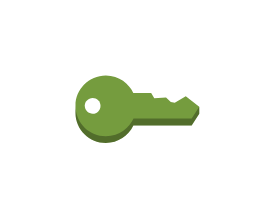
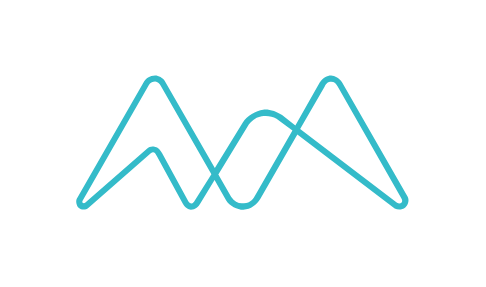
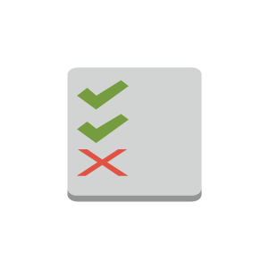
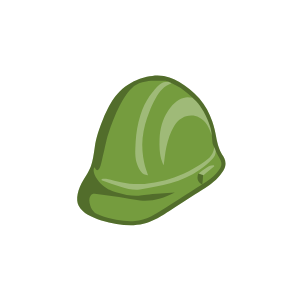

# Aws17 Security Identity and Compliance Entities

- [AddOn](./add-on.md)  

- [Agent](./agent.md)  

- [Artifact](./artifact.md)  

- [CertificateManager](./certificate-manager.md)  

- [CertificateManager2](./certificate-manager-2.md)  

- [Clouddirectory](./clouddirectory.md)  

- [Cloudhsm](./cloudhsm.md)  

- [DataEncryptionKey](./data-encryption-key.md)  

- [DirectoryService](./directory-service.md)  

- [EncryptedData](./encrypted-data.md)  

- [FilteringRule](./filtering-rule.md)  

- [Iam](./iam.md)  

- [Inspector](./inspector.md)  

- [Kms](./kms.md)  

- [LongTermSecurityCredential](./long-term-security-credential.md)  

- [Macie](./macie.md)  

- [MfaToken](./mfa-token.md)  

- [Organizations](./organizations.md)  

- [Permissions](./permissions.md)  

- [Role](./role.md)  

- [Shield](./shield.md)  

- [Sts](./sts.md)  

- [Sts2](./sts-2.md)  

- [TemporarySecurityCredential](./temporary-security-credential.md)  

- [Waf](./waf.md)  

