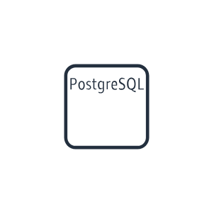

# Aws18 Database Entities

- [AmazonAurora](./amazon-aurora.md)  

- [AmazonDynamodb](./amazon-dynamodb.md)  

- [AmazonElasticache](./amazon-elasticache.md)  

- [AmazonElasticacheForMemcached](./amazon-elasticache-for-memcached.md)  

- [AmazonElasticacheForRedis](./amazon-elasticache-for-redis.md)  

- [AmazonNeptune](./amazon-neptune.md)  

- [AmazonRds](./amazon-rds.md)  

- [AmazonRedshift](./amazon-redshift.md)  

- [Attribute](./attribute.md)  

- [Attributes](./attributes.md)  

- [AwsDatabaseMigrationService](./aws-database-migration-service.md)  

- [CacheNode](./cache-node.md)  

- [DatabaseMigrationWorkflowJob](./database-migration-workflow-job.md)  

- [DbInstance](./db-instance.md)  

- [DbInstanceReadReplica](./db-instance-read-replica.md)  

- [DbInstanceStandby](./db-instance-standby.md)  

- [DenseComputeNode](./dense-compute-node.md)  

- [DenseStorageNode](./dense-storage-node.md)  

- [GlobalSecondaryIndex](./global-secondary-index.md)  

- [Item](./item.md)  

- [Items](./items.md)  

- [MsSqlInstance](./ms-sql-instance.md)  

- [MsSqlInstanceAlternate](./ms-sql-instance-alternate.md)  

- [MysqlDbInstance](./mysql-db-instance.md)  

- [MysqlDbInstanceAlternate](./mysql-db-instance-alternate.md)  

- [OracleDbInstance](./oracle-db-instance.md)  

- [OracleDbInstanceAlternate](./oracle-db-instance-alternate.md)  

- [Piop](./piop.md)  

- [PostgresqlInstance](./postgresql-instance.md)  

- [SqlPrimary](./sql-primary.md)  

- [SqlReplica](./sql-replica.md)  

- [Table](./table.md)  

