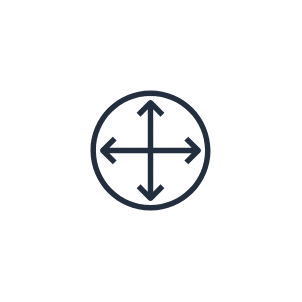
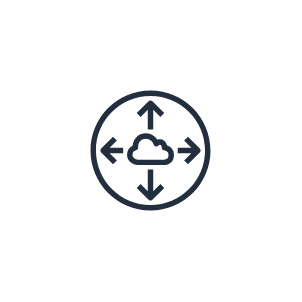
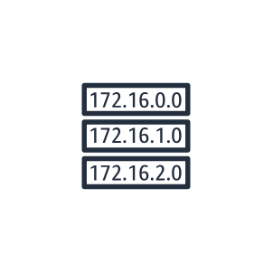

# Aws18 Network &amp; Content Delivery Entities

- [AmazonApiGateway](./amazon-api-gateway.md)  

- [AmazonCloudfront](./amazon-cloudfront.md)  

- [AmazonRoute53](./amazon-route-53.md)  

- [AmazonVpc](./amazon-vpc.md)  

- [AwsDirectConnect](./aws-direct-connect.md)  

- [AwsPrivatelink](./aws-privatelink.md)  

- [CustomerGateway](./customer-gateway.md)  

- [DownloadDistribution](./download-distribution.md)  

- [EdgeLocation](./edge-location.md)  

- [ElasticNetworkAdapter](./elastic-network-adapter.md)  

- [ElasticNetworkInterface](./elastic-network-interface.md)  

- [Endpoints](./endpoints.md)  

- [FlowLogs](./flow-logs.md)  

- [HostedZone](./hosted-zone.md)  

- [InternetGateway](./internet-gateway.md)  

- [NatGateway](./nat-gateway.md)  

- [NetworkAccessControlList](./network-access-control-list.md)  

- [Peering](./peering.md)  

- [RouteTable](./route-table.md)  

- [Router](./router.md)  

- [StreamingDistribution](./streaming-distribution.md)  

- [VpnConnection](./vpn-connection.md)  

- [VpnGateway](./vpn-gateway.md)  

