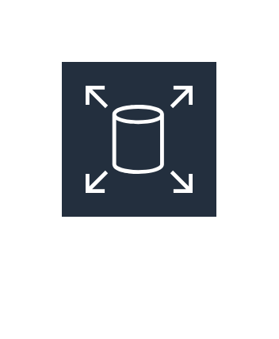
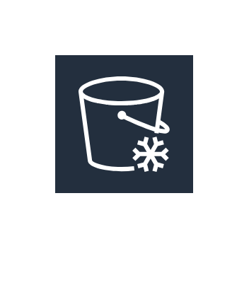
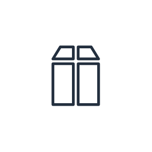
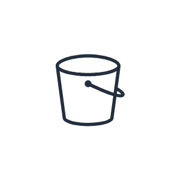
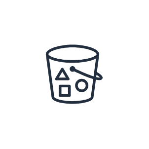
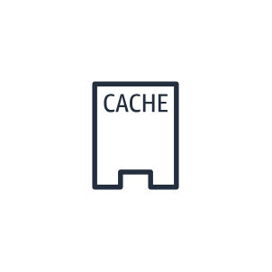
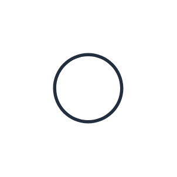
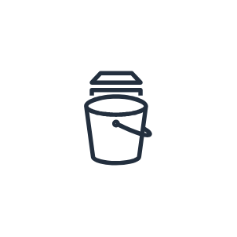

# Aws18 Storage Entities

- [AmazonElasticBlockStore](./amazon-elastic-block-store.md)  

- [AmazonElasticFileSystem](./amazon-elastic-file-system.md)  

- [AmazonGlacier](./amazon-glacier.md)  

- [AmazonS3](./amazon-s3.md)  

- [Archive](./archive.md)  

- [AwsSnowball](./aws-snowball.md)  

- [AwsSnowballEdge](./aws-snowball-edge.md)  

- [AwsSnowmobile](./aws-snowmobile.md)  

- [AwsStorageGateway](./aws-storage-gateway.md)  

- [Bucket](./bucket.md)  

- [BucketWithObjects](./bucket-with-objects.md)  

- [CachedVolume](./cached-volume.md)  

- [ImportExport](./import-export.md)  

- [NonCachedVolume](./non-cached-volume.md)  

- [Object](./object.md)  

- [Snapshot](./snapshot.md)  

- [Vault](./vault.md)  

- [VirtualTapeLibrary](./virtual-tape-library.md)  

- [Volume](./volume.md)  

