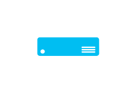

# Server

## Definition

```js
{
  _style: {
    entity: 'verticalLabelPosition=bottom;html=1;verticalAlign=top;align=center;strokeColor=none;fillColor=#00BEF2;shape=mxgraph.azure.server;',
  },
  _width: 50,
  _height: 15,
}
```

## Usage

```js
import { Server } from '@dinghy/standard-components-diagrams/azure'

<Server/>
```

## Preview


