# Azure2 AI and Machine Learning Entities

- [AiStudio](./ai-studio.md)  
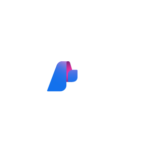

- [AnomalyDetector](./anomaly-detector.md)  

- [AppliedAi](./applied-ai.md)  

- [BatchAi](./batch-ai.md)  
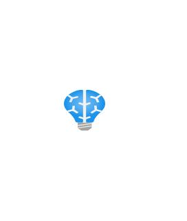

- [Bonsai](./bonsai.md)  
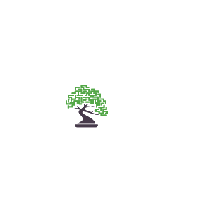

- [BotServices](./bot-services.md)  
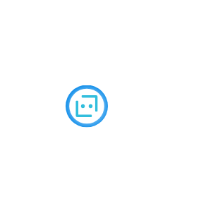

- [CognitiveSearch](./cognitive-search.md)  
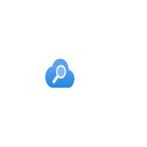

- [CognitiveServices](./cognitive-services.md)  

- [CognitiveServicesDecisions](./cognitive-services-decisions.md)  
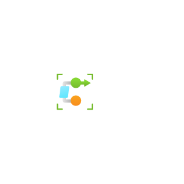

- [ComputerVision](./computer-vision.md)  
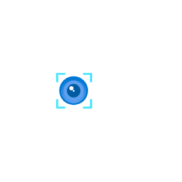

- [ContentModerators](./content-moderators.md)  

- [ContentSafety](./content-safety.md)  
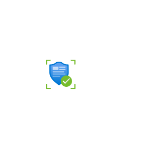

- [CustomVision](./custom-vision.md)  
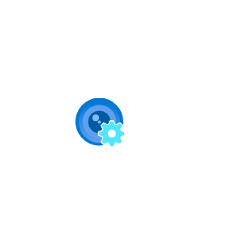

- [ExperimentationStudio](./experimentation-studio.md)  

- [FaceApis](./face-apis.md)  
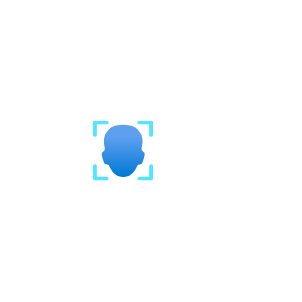

- [FormRecognizers](./form-recognizers.md)  
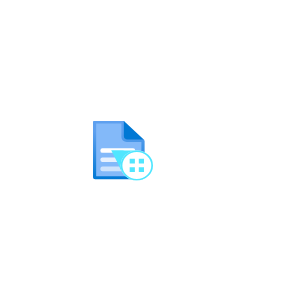

- [Genomics](./genomics.md)  
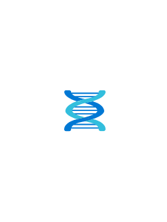

- [ImmersiveReaders](./immersive-readers.md)  

- [Language](./language.md)  
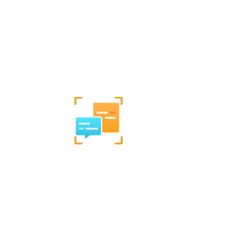

- [LanguageUnderstanding](./language-understanding.md)  
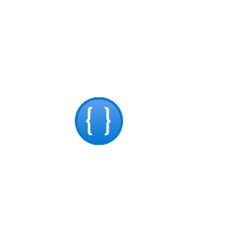

- [MachineLearning](./machine-learning.md)  

- [MachineLearningStudioClassicWebServices](./machine-learning-studio-classic-web-services.md)  

- [MachineLearningStudioWebServicePlans](./machine-learning-studio-web-service-plans.md)  

- [MachineLearningStudioWorkspaces](./machine-learning-studio-workspaces.md)  
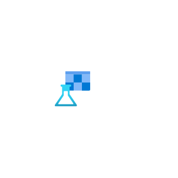

- [MetricsAdvisor](./metrics-advisor.md)  

- [ObjectUnderstanding](./object-understanding.md)  
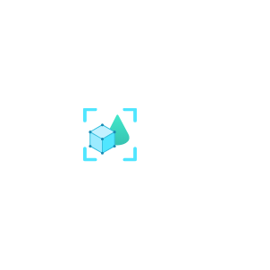

- [Openai](./openai.md)  
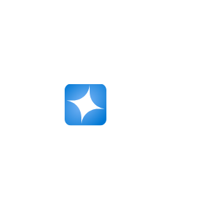

- [Personalizers](./personalizers.md)  

- [QnaMakers](./qna-makers.md)  

- [ServerlessSearch](./serverless-search.md)  

- [SpeechServices](./speech-services.md)  
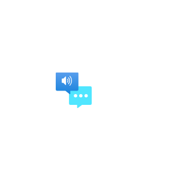

- [TranslatorText](./translator-text.md)  
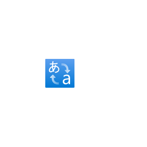
