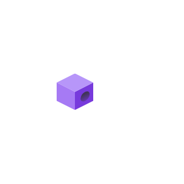
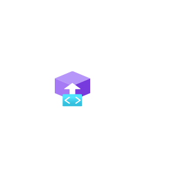
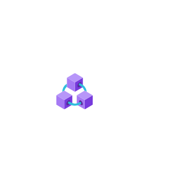
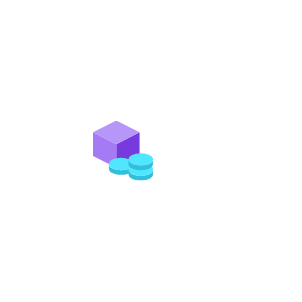

# Azure2 Blockchain Entities

- [AbsMember](./abs-member.md)  

- [BlockchainApplications](./blockchain-applications.md)  

- [BlockchainService](./blockchain-service.md)  

- [Consortium](./consortium.md)  

- [OutboundConnection](./outbound-connection.md)  

- [TokenService](./token-service.md)  

