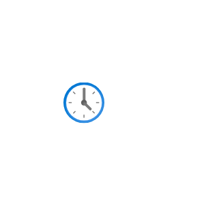

# Recent

## Definition

```js
{
  _style: {
    entity: 'image;aspect=fixed;html=1;points=[];align=center;fontSize=12;image=img/lib/azure2/general/Recent.svg;strokeColor=none;',
  },
  _original_width: 68,
  _original_height: 68,

}
```

## Usage

```js
import { Recent } from '@dinghy/standard-components-diagrams/azure2General'

<Recent/>
```

## Preview


