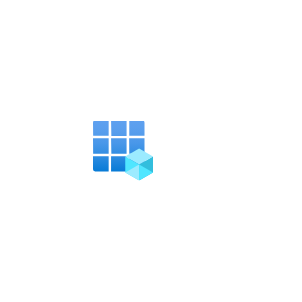

# Azure2 Identity Entities

- [AadLicenses](./aad-licenses.md)  

- [ActiveDirectory](./active-directory.md)  

- [ActiveDirectoryConnectHealth](./active-directory-connect-health.md)  

- [ActiveDirectoryConnectHealth2](./active-directory-connect-health-2.md)  

- [AdB2c](./ad-b2c.md)  

- [AdDomainServices](./ad-domain-services.md)  

- [AdIdentityProtection](./ad-identity-protection.md)  

- [AdPrivilegeIdentityManagement](./ad-privilege-identity-management.md)  

- [AdRolesAndAdministrators](./ad-roles-and-administrators.md)  

- [AdministrativeUnits](./administrative-units.md)  

- [ApiProxy](./api-proxy.md)  

- [AppRegistrations](./app-registrations.md)  

- [AzureAdB2c](./azure-ad-b2c.md)  

- [CustomAzureAdRoles](./custom-azure-ad-roles.md)  

- [EnterpriseApplications](./enterprise-applications.md)  

- [EntraConnect](./entra-connect.md)  

- [EntraDomainServices](./entra-domain-services.md)  

- [EntraGlobalSecureAccess](./entra-global-secure-access.md)  

- [EntraIdProtection](./entra-id-protection.md)  

- [EntraInternetAccess](./entra-internet-access.md)  

- [EntraManagedIdentities](./entra-managed-identities.md)  

- [EntraPrivateAccess](./entra-private-access.md)  

- [EntraPrivilegedIdentityManagement](./entra-privileged-identity-management.md)  

- [EntraVerifiedId](./entra-verified-id.md)  

- [ExternalIdentities](./external-identities.md)  

- [Groups](./groups.md)  

- [IdentityGovernance](./identity-governance.md)  

- [InformationProtection](./information-protection.md)  

- [ManagedIdentities](./managed-identities.md)  

- [MultiFactorAuthentication](./multi-factor-authentication.md)  

- [Pim](./pim.md)  

- [Security](./security.md)  

- [TenantProperties](./tenant-properties.md)  

- [UserSettings](./user-settings.md)  

- [Users](./users.md)  

- [VerifiableCredentials](./verifiable-credentials.md)  

- [VerificationAsAService](./verification-as-a-service.md)  

