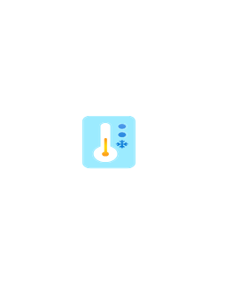

# Defender Freezer Monitor

## Definition

```js
{
  _style: {
    entity: 'image;aspect=fixed;html=1;points=[];align=center;fontSize=12;image=img/lib/azure2/other/Defender_Freezer_Monitor.svg;strokeColor=none;',
  },
  _width: 47.599999999999994,
  _height: 68,
}
```

## Usage

```js
import { DefenderFreezerMonitor } from '@dinghy/standard-components-diagrams/azure2Other'

<DefenderFreezerMonitor/>
```

## Preview


