# Cae Enterprise (flat) Entities

- [AndroidPhone](./android-phone.md)  

- [Application](./application.md)  

- [ApplicationBlank](./application-blank.md)  

- [ApplicationGeneric](./application-generic.md)  

- [ApplicationServer](./application-server.md)  

- [ApplicationServer2](./application-server-2.md)  

- [BackupLocal](./backup-local.md)  

- [BackupLocal2](./backup-local-2.md)  

- [Calendar](./calendar.md)  

- [Certificate](./certificate.md)  

- [ClientApplication](./client-application.md)  

- [Cloud](./cloud.md)  
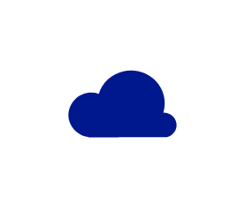

- [Cloud2](./cloud-2.md)  
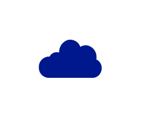

- [ClusterServer](./cluster-server.md)  

- [CodeFile](./code-file.md)  

- [Connectors](./connectors.md)  
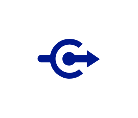

- [DatabaseGeneric](./database-generic.md)  

- [DatabaseServer](./database-server.md)  

- [DatabaseSynchronization](./database-synchronization.md)  

- [Device](./device.md)  
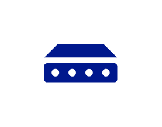

- [DirectAccessFeature](./direct-access-feature.md)  

- [Document](./document.md)  

- [DocumentDbFile](./document-db-file.md)  

- [DomainController](./domain-controller.md)  

- [EnterpriseBuilding](./enterprise-building.md)  

- [FederationServices](./federation-services.md)  

- [FederationServicesProxy](./federation-services-proxy.md)  

- [FileGeneral](./file-general.md)  

- [Filter](./filter.md)  

- [Firewall](./firewall.md)  

- [Folder](./folder.md)  

- [Gateway](./gateway.md)  

- [Graph](./graph.md)  

- [HealthMonitoring](./health-monitoring.md)  

- [Healthy](./healthy.md)  

- [ImportGeneric](./import-generic.md)  

- [InternetHollow](./internet-hollow.md)  
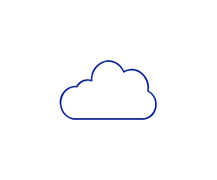

- [KeyPermissions](./key-permissions.md)  

- [Keyboard](./keyboard.md)  

- [Laptop](./laptop.md)  

- [LoadBalancerGeneric](./load-balancer-generic.md)  
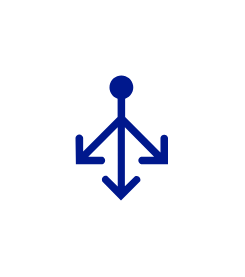

- [LoadTesting](./load-testing.md)  

- [LockUnlocked](./lock-unlocked.md)  

- [LockProtected](./lock-protected.md)  

- [Maintenance](./maintenance.md)  

- [ManagementConsole](./management-console.md)  

- [Message](./message.md)  

- [Mobile](./mobile.md)  

- [Monitor](./monitor.md)  

- [MonitorRunningApps](./monitor-running-apps.md)  

- [Mouse](./mouse.md)  

- [NetworkCard](./network-card.md)  

- [NotAllowed](./not-allowed.md)  

- [Pack](./pack.md)  

- [Performance](./performance.md)  

- [PerformanceMonitor](./performance-monitor.md)  

- [PlugAndPlay](./plug-and-play.md)  
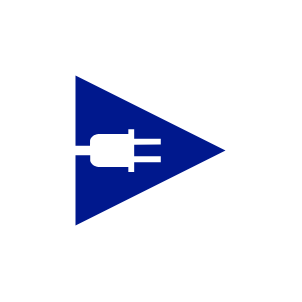

- [Powerpoint](./powerpoint.md)  

- [PowershellFile](./powershell-file.md)  

- [ProtocolStack](./protocol-stack.md)  
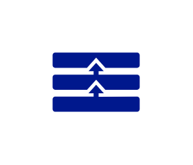

- [QueueGeneric](./queue-generic.md)  

- [RmsConnector](./rms-connector.md)  

- [Router](./router.md)  
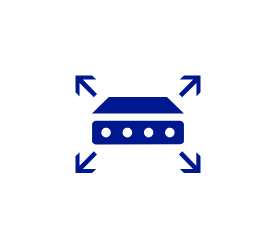

- [RpdRemotingFile](./rpd-remoting-file.md)  

- [ScriptFile](./script-file.md)  

- [SecureVirtualMachine](./secure-virtual-machine.md)  
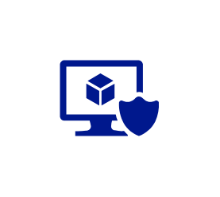

- [ServerBlade](./server-blade.md)  

- [ServerGeneric](./server-generic.md)  

- [ServerDirectory](./server-directory.md)  

- [ServerFarm](./server-farm.md)  

- [ServerRack](./server-rack.md)  
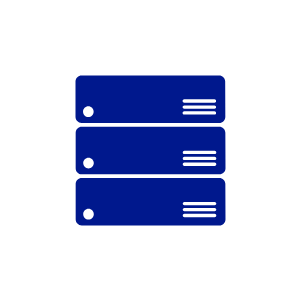

- [Settings](./settings.md)  

- [SharedFolder](./shared-folder.md)  

- [Smartcard](./smartcard.md)  

- [StartupTask](./startup-task.md)  

- [Storage](./storage.md)  

- [Table](./table.md)  

- [Tablet](./tablet.md)  

- [Tool](./tool.md)  

- [Triggers](./triggers.md)  

- [Tunnel](./tunnel.md)  

- [UdfFunction](./udf-function.md)  

- [Unhealthy](./unhealthy.md)  

- [Unhealthy2](./unhealthy-2.md)  

- [Usb](./usb.md)  

- [UserEnterprise](./user-enterprise.md)  

- [UserPermissions](./user-permissions.md)  

- [Video](./video.md)  

- [VirtualMachine](./virtual-machine.md)  
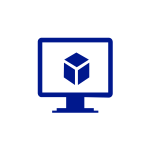

- [WebServer](./web-server.md)  

- [WebsiteGeneric](./website-generic.md)  

- [WindowsServer](./windows-server.md)  

- [WirelessConnection](./wireless-connection.md)  

- [WorkstationClient](./workstation-client.md)  

- [XmlWebService](./xml-web-service.md)  

